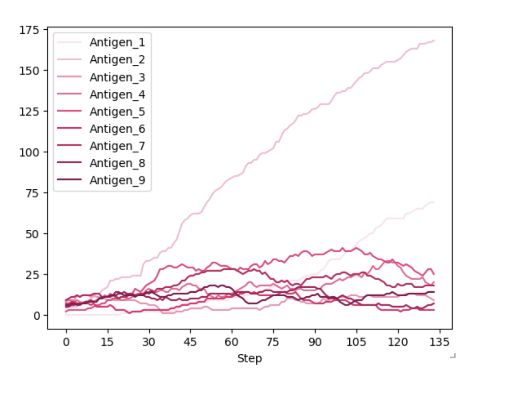

# Immune Evasion Modelling




## Background
The aim of this project was to develop a reductionist agent-based model of immune evasion through downregulation of peptide-HLA.

The model utilises the Mesa framework to develop a simple 20x20 grid, with two different cell classes:
1. TumourCell
2. ImmuneCell

Both cell classes inherit parameters from the BaseCell class.

The model can be initialised with varying numbers of immune and tumour cell agents. The proportion of initial peptide-HLA can be adjusted for different experimental runs.

Tumour cells have a 10% chance of proliferating each step the model takes, with a further 15% chance of mutating their graded level of peptide-HLA. Mutations are set to change +/- 1 level of peptide per mutation (from 1-9). These can also be adjusted to fit different cell-line characteristics. 

As the model progresses, the ImmuneCell agents migrate preferentially towards TumourCell agents, replicating chemokine gradients. If a TumourCell and ImmuneCell agent share the same square on the grid, and the peptide-HLA score is greater than the defined level (in this case a score of 2) the ImmuneCell will kill the TumourCell.

Population dynamics are tracked over time and can be viewed as the model is running, as well as after. 

## Installation
Clone the repository and create the environment:

```bash
git clone https://github.com/jakeanthony123/evasion-modelling.git
cd evasion-modelling
conda env create -f environment.yml
conda activate evasion
```

## Usage

There are two ways to run the model.

### Interactive dashboard

Launch the Solara app to view the simulation live in a browser:

```bash
solara run app.py
```

This opens at `http://localhost:8765`. The dashboard shows the grid with
tumour cells shaded by peptide-HLA level, alongside population and
peptide-HLA distribution plots. Cell counts can be adjusted with the
sliders, and the model can be stepped, played and reset from the toolbar.

To apply new slider values, stop the model first, adjust the sliders,
then press reset.

### Notebook

Open the notebook to run the model in batch and inspect the collected
data directly:

```bash
jupyter notebook evasion_model.ipynb
```

This runs the model for a set number of steps and plots the resulting
population dynamics from the DataCollector.

The agent and model definitions in `app.py` mirror those in the notebook.
